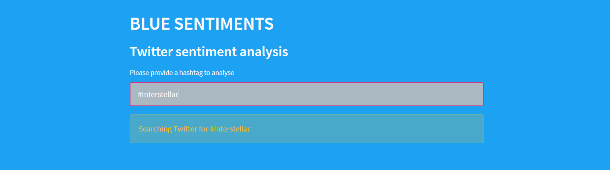
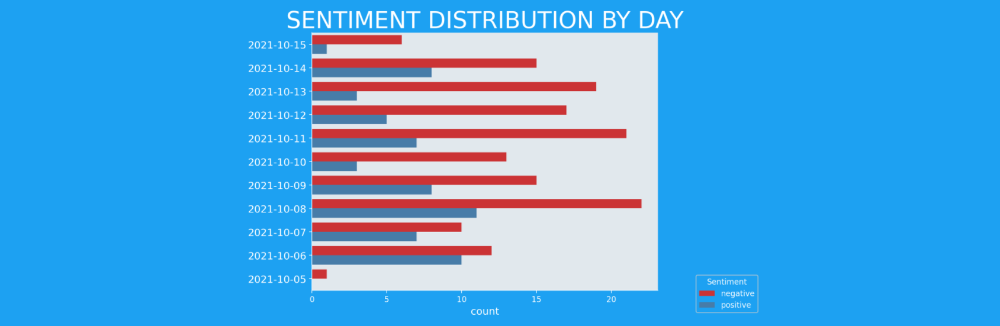

# BLUE SENTIMENTS: a Twitter sentiment analysis app

BLUE SENTIMENTS analyses sentiments of tweets. Users can 
provide a hashtag of their preference. The app will scrape
Twitter, preprocess the tweets and predict the sentiment. 

BLUE sentiments provides the user with the following features: 
+ a table showing the scraped, preprocessed tweets and the sentiment prediction
+ a graph showing the tweet sentiments ordered by day
+ a wordcloud with the most frequently found words

## Try the app

The app is deployed on <a href=https://share.streamlit.io/maartenvdbulcke/twitter_sentiments/main taget="blank_">Streamlit share</a>.

## NLP: Natural Language Processing

NLP is a powerful AI technique by which computers can handle 
natural language. 
I tested 3 pretrained sentiment analysis models on their accuracy.
All models were tested on the <a href=http://help.sentiment140.com/for-students target="blank_">Sentiment140 dataset</a>.

+ <a href=https://github.com/flairNLP/flair target="blank_">Flair</a>
+ <a href=https://www.nltk.org/ target="blank_">NLTK</a>
+ <a href=https://textblob.readthedocs.io/en/dev/ target="blank_">TextBlob</a>

Flair had the best auc score (66%). But as it runs on Pytorch it is too heavy
to deploy to Heroku or Streamlit. 
NLTK had an auc score of 63% which was better than TextBlob (61%). 
Because TextBlob ran faster, BLUE SENTIMENTS makes use of TextBlob.

## Installation

BLUE SENTIMENTS runs on Python 3.7

### Packages
    pandas      == 1.2.4
    matplotlib  == 3.4.3
    seaborn     == 0.11.2
    spacy       == 3.1
    nltk        == 3.5
    textblob    == 0.15.3
    emot        == 3.1
    wordcloud   == 1.8.1
    streamlit   == 1.0.0

BLUE SENTIMENTS uses <a href=https://github.com/twintproject/twint target="blank_">
Twint</a> to scrape Twitter. To be able to use Twint when the app
is deployed, Twint has to be added to the requirements.txt file in the following fashion:

    git+git://github.com/twintproject/twint.git@origin/master#egg=twint

### Docker

The easiest way to use this app is to pull the 
<a href=https://hub.docker.com/repository/docker/maartenvdbulcke/blue-sentiments target="blank_">Docker Hub image</a>. 
This image is ready to be deployed, for example Streamlit share. The app is to heavy for the free tier on Heroku.
This image does not run locally.

### Impressions

 
 
 

# Author 
| Name                   | Github                              |
|------------------------|-------------------------------------|
| Maarten Van den Bulcke | https://github.com/MaartenVdBulcke  |

# Timeline
11/10/2021 - 15/10/2021
